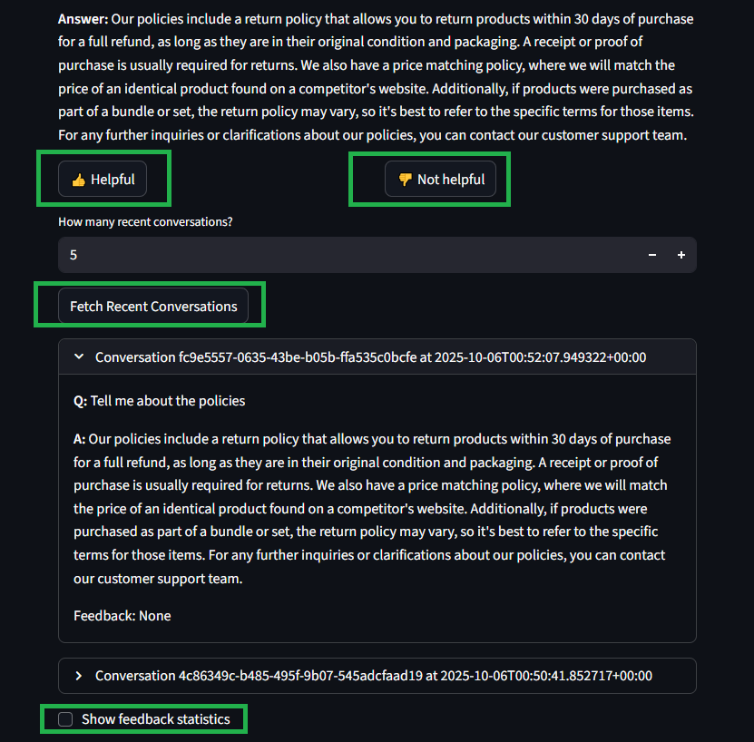
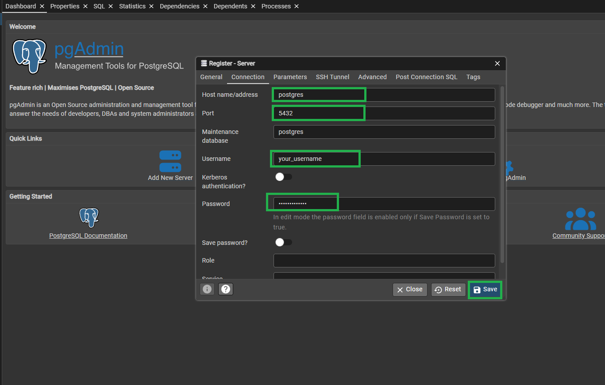

# LLM Zoomcamp 2025 PROJECT 
## RAG based Chatbot for e-commerce platform FAQ


🧠 Project Summary — RAG Chatbot for E-commerce FAQ

Modern e-commerce platforms receive large volumes of repetitive customer inquiries—such as questions about orders, shipping, returns, payments, and product details. Handling these requests manually or through static FAQ pages often leads to long response times, inconsistent answers, and poor customer experience.

This project tackles those challenges by implementing a Retrieval-Augmented Generation (RAG) chatbot, designed to provide accurate, context-aware, and dynamic responses to user queries. Instead of relying solely on predefined answers, the chatbot retrieves the most relevant information from the company’s FAQ and knowledge base, then uses a language model to generate natural, precise replies.

The solution reduces customer support workload, ensures information consistency, and enables scalable 24/7 assistance — improving both response quality and user satisfaction while lowering operational costs.

This project was implemented for 
[LLM Zoomcamp](https://github.com/DataTalksClub/llm-zoomcamp) -
a free course about LLMs and RAG.

💡 Key Use Cases

* Order Tracking: Responds to “Where is my order?” or “Has my package shipped?” using the latest delivery info.

* Returns & Refunds: Explains the company’s return policy, timelines, and steps for requesting a refund.

* Payment & Billing Questions: Clarifies accepted payment methods or issues with failed transactions.

* Product Information: Retrieves detailed specifications, size guides, or warranty info from the FAQ.

* Account & Profile Help: Guides users on updating personal data, resetting passwords, or managing notifications.

* Customer Support Deflection: Handles routine queries automatically, freeing human agents for complex issues.

### Dataset

The dataset used in this project comes from [E-commerce_FAQ](https://github.com/imsoumya18/E-commerce_FAQ) the data consists 79 rows with two simple columns

* `prompt`:  Question
* `response`: Answer


### Technologies

- Python 3.12
- Docker and Docker Compose for containerization
- [Qdrant](https://github.com/alexeygrigorev/minsearch) for Hybrid Vector Search | Vector DB service
- Flask as the API interface (see [Background](#background) for more information on Flask)
- Grafana for monitoring and PostgreSQL as the backend for it
- OpenAI as an LLM

### Preparation

🧩 Development Environment
This project was developed and tested within a WSL2 (Windows Subsystem for Linux 2) environment.
All provided Dockerfiles, docker-compose configurations, and command-line instructions are designed and verified to run seamlessly under WSL2.
Minor adaptations may be required if running on native Linux or macOS environments.

⚙️ Environment Configuration

This project relies on environment variables defined in a .env file located in the project root directory.
The .env file must include the following variables:

```bash
APP_PORT=5000

POSTGRES_HOST=postgres
POSTGRES_DB=course_assistant
POSTGRES_USER=your_username
POSTGRES_PASSWORD=your_password
POSTGRES_PORT=5432

OPENAI_API_KEY=yourkey
```

These variables are automatically loaded and used by the Dockerfiles and docker-compose configurations.

⚠️ Important:
The `OPENAI_API_KEY` variable is required for the chatbot’s retrieval-augmented generation (RAG) functionality.
Without this key, the API calls to the OpenAI models will fail, and the assistant will not generate responses.
Make sure to store this key securely and never commit it to version control.

🧪 Testing Note

When running tests, ensure that a .env file is created following the structure above so that all services and environment variables are correctly resolved within the containers.


🚀 Running the Project

You can start the project using the provided startup script or by manually running the Docker Compose commands.

🔧 Option 1: Using the Startup Script

Make the script executable and run it:

```bash
  chmod +x start.sh
  
  ./start.sh
```
This will automatically build and start all required 
services (infrastructure and application).

🐳 Option 2: Using Docker Compose Manually

If you prefer to control each step individually, you can run the following commands:

🏗️ Build Infrastructure
`docker compose -f docker-compose-infra.yaml build --no-cache`

▶️ Start Infrastructure
```bash
docker compose -f docker-compose-infra.yaml up --build
```

🧩 Build Application
```bash
docker compose -f docker-compose-app.yaml build --no-cache`
```

▶️ Start Application
```bash
docker compose -f docker-compose-app.yaml up --build`
```

🧹 Stopping and Removing Services

To stop and remove the running containers:

```bash
# Stop and remove infrastructure services
docker compose -f docker-compose-infra.yaml down

# Stop and remove application services
docker compose -f docker-compose-app.yaml down
```

### App


💻 Application Overview

Once all services are up and running, the application will be accessible at:
👉 [http://localhost:8501](http://localhost:8501)

🗨️ Making a Query


💬 Viewing the Answer

The chatbot retrieves and displays the most relevant response from the FAQ knowledge base.


📊 Additional Features

The app also includes:

Helpful / Not Helpful feedback buttons

Fetch Recent Conversations to review previous interactions

Feedback Statistics for quick performance insights



### Credentials

🔐 Default Credentials
🐘 PgAdmin

Access the PostgreSQL management interface at:
👉 http://localhost:5050

Login Credentials

```bash
  Email:    admin@admin.com
  Password: admin
```

These values are set in the `docker-compose-infra.yaml` under the pgadmin service:

```yaml
  environment:
    PGADMIN_DEFAULT_EMAIL: admin@admin.com
    PGADMIN_DEFAULT_PASSWORD: admin
```

🧩 Add a New Server Connection

Once logged in, create a new server connection:

1. Click “Add New Server”


2. In the Connection tab, configure the following settings:

| Field                 | Value           |
| --------------------- | --------------- |
| **Host name/address** | `postgres`      |
| **Port**              | `5432`          |
| **Username**          | `your_username` |
| **Password**          | `your_password` |


These values come from the .env(that must be created) file used by the Docker setup.




📈 Grafana

Access the monitoring dashboard at:
👉 http://localhost:3000

Login Credentials

```bash
  Username: admin
  Password: admin123
```

```yaml
  environment:
  - GF_SECURITY_ADMIN_USER=admin
  - GF_SECURITY_ADMIN_PASSWORD=admin123
```

## ANNEX

### Generate uv env

```bash
uv venv
```

* Activate env
  
  ```bash
    source .venv/bin/activate
  ```  

### Syncing uv env | Recovering the uv

When closing the wsl, the PATH is changed so the syncing of the uv venv is necessary to get the venv working


✅ Optional flags

You can customize behavior:

`uv sync --all-extras` → install all optional dependencies defined in the TOML

`uv sync --dev` → include development dependencies

`uv sync --frozen` → strictly use the existing lockfile (fail if it’s outdated)

`uv sync --python 3.11` → use a specific Python version

**Obs** The jupyter notebook is not listed in the `uv.lock` \ `pyproject.toml` 
so it's needed to install it via `uv pip install jupyter notebook`, the `uv pip install` does not add the library to the `uv.lock` \ `pyproject.toml`


* For using the venv in jupyter notebook, installing kernel
```bash
uv pip install ipykernel
python -m ipykernel install --user --name=.venv --display-name "Python (uv .venv)"
```

* uninstalling kernel
```bash
    jupyter kernelspec list
```

```bash
    jupyter kernelspec uninstall .venv
```

### *Encounter Issue*

Gunicorn workers were doing race condition between mulltiple workers hitting Qdrant (`get_collection()`) before Qdrant server was up

* Summary
Here’s what’s happening:

* Your Gunicorn worker starts up, imports rag.py.

* `rag.py`  calls `ingest.load_index()` at import time.

* That function tries to `get_collection()`, doesn’t find it immediately (race condition between multiple workers hitting Qdrant), so it goes ahead and creates it.

* Another worker does the same thing at the same time → duplicate `create_collection` → `409 Conflict`.

* Gunicorn sees a worker crash → exits the master with code 3.

### *Solution* 

* **this chunk of code at `app.py`** 
```
# ✅ Initialize collection only once before workers start
with app.app_context():
    ingest.load_index()
``` 
* **run initialization exactly once before Gunicorn forks workers**

Create a small init step (run once) that calls `ingest.load_index()` and only then starts Gunicorn. This guarantees one-time init and avoids worker races. `entrypoint.sh`


### CURL

```
curl -X POST http://localhost:8000/question \
  -H "Content-Type: application/json" \
  -d '{"question": "What is the meaning of life?"}'
```

```
curl -X POST http://localhost:8000/question \
  -H "Content-Type: application/json" \
  -d '{"question": "which are the policies?"}'
```

### Postgres service

* test connection with `test_pg_connection.py`, once inside the container with `docker exec -it <container_name> bash` you need to start the env
with `source .venv/bin/activate` after that run `python test_pg_connection.py`. Remember the `python:3.12-slim` does not have the libraries, it's the
`.venv` the virtual enviroment with the needed libraries. after testint the connection the output should be 


```bash
  ✅ Connected to Postgres: ('PostgreSQL 16.3 (Debian 16.3-1) on x86_64-pc-linux-gnu...',)
```


### PGadmin

🔑 Access

* Open `http://localhost:5050`

* Login with:

  * Email: `admin@admin.com`

  * Password: `admin`

➕ **Add a Postgres server in pgAdmin**

1. Once inside pgAdmin, click **Add New Server**.

2. In **General → Name**: `Postgres (docker)` (or any label).

3. In **Connection**:

    * Host name/address: **postgres** (this matches the service name in Docker Compose)

    * Port: **5432**

    * Database: **course_assistant** (from your env file)

    * Username: **your_username**

    * Password: **your_password**
  

### Feedback

```bash
ID="6e1cc7c4-c194-43f3-8c26-0ceaa29107fd"

FEEDBACK_DATA='{
  "conversation_id": "'${ID}'",
  "feedback": 1
}'

curl -X POST -H "Content-Type: application/json" -d "${FEEBACK_DATA}" ${URL}/feedback
```

```bash
docker compose -f docker-compose-app.yaml build --no-cache    
```

